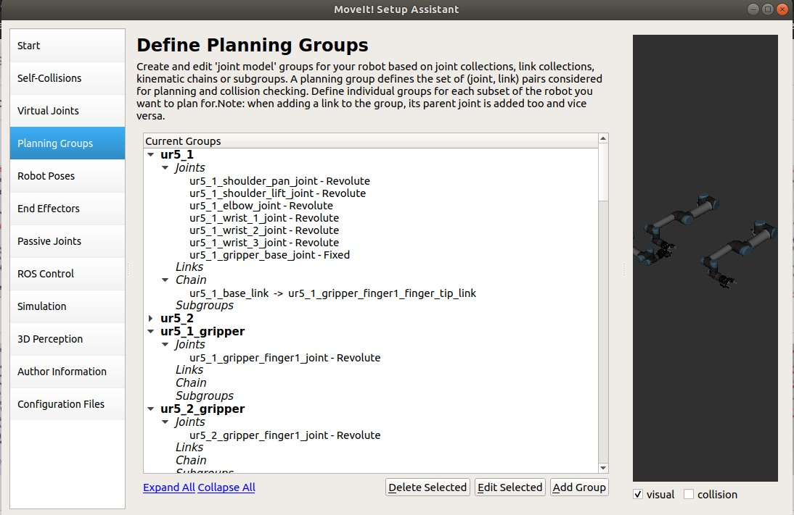

Multiple Arm setup tutorial
==================================

To run multiple arms Asyncronously, following these steps.
 1. Combine all robot arm URDF in single xacro file
 2. Create different Planning Groups with specific arms to be used in Asyncronously.
 3. Write Script to manipulate each arm's end Effector to desired pose.  

URDF Setup
----------
Ur5 Arm with Robotiq Gripper is used to complete Multiple Arm Setup.

.. tutorial-formatter:: ./multiple_ur_description/urdf/multiple_ur5_robotiq.urdf.xacro

setup Assistant Configuration
-----------------------------

Open three shells. in first shell Start gazebo and Spawn the model: ::

  roslaunch multiple_ur_description multiple_ur5_robotiq.launch

In the second shell, here Start Bring Up file for manipulation: ::

  roslaunch multiple_ur_manipulation bringup.launch

In the third shell, Run the cpp Script: ::

  roslaunch multiple_arms_scripts multiple_arm_move

The Entire Code
---------------
The entire code can be seep through the code piece by piece to explain its functionality.

.. tutorial-formatter:: ./multiple_arms_scripts/src/dual_arm_move.cpp

The Launch File
---------------
The entire launch fill the code in this tutorial can be run from the **moveit_tutorials** package that you have as part of your MoveIt setup.
